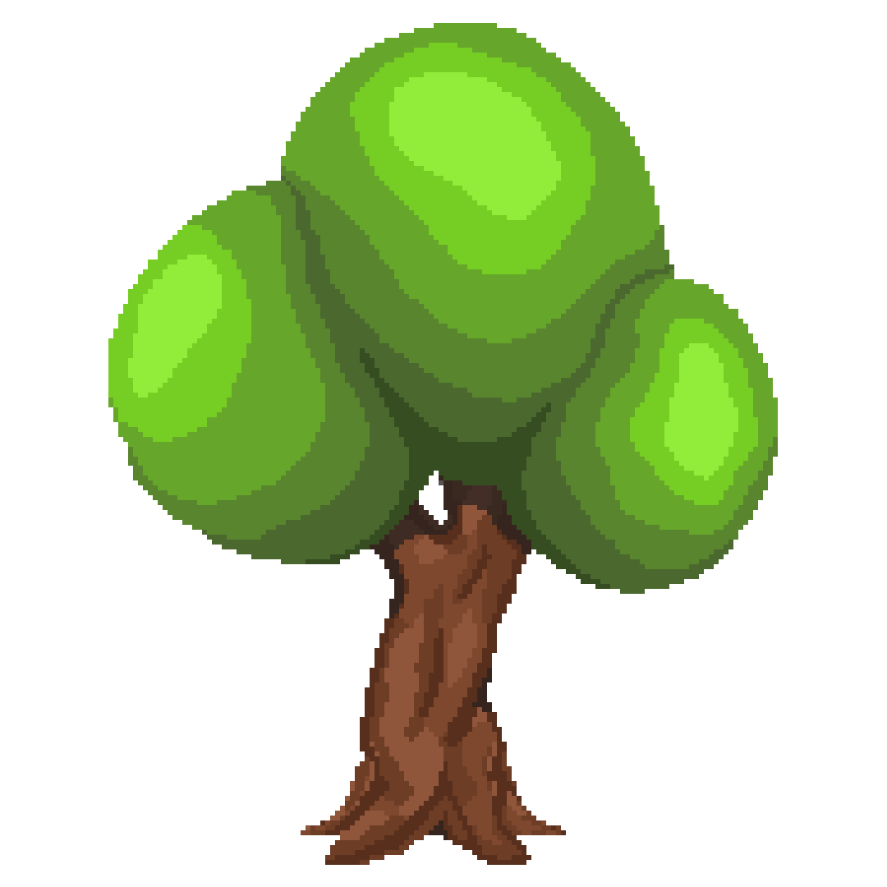

# Welcome

## Tree Farmer

Tree Farmer is an upcoming [**BreMea Development**](https://bremea.com) product, more specifically a game you play on a Discord Bot. In this game, you can create a farm where you harvest trees, sell logs and make revenue. Over time, you can earn real life rewards through competition or simply by playing the game. Prizes include Discord Nitro or other gift cards. Overall, Tree Farmer is an easy to use game bot because it uses Slash Commands and Buttons instead of regular text commands. There are many graphics, animations and emojis will help bring you into the exciting new game. **To get join the game, head over to** [**Getting Started**](info/start.md#starting-a-tree-farm)**.**


Tree Farmer is currently in **public beta** and cannot be invited to your server. You can help test out Tree Farmer by joining the [**Community Server**](https://treefarmer.xyz/discord).


## Quick Links


[start.md](info/start.md)



[commands.md](info/commands.md)



[shop.md](other/shop.md)



[team.md](other/team.md)



[terms.md](other/terms.md)


